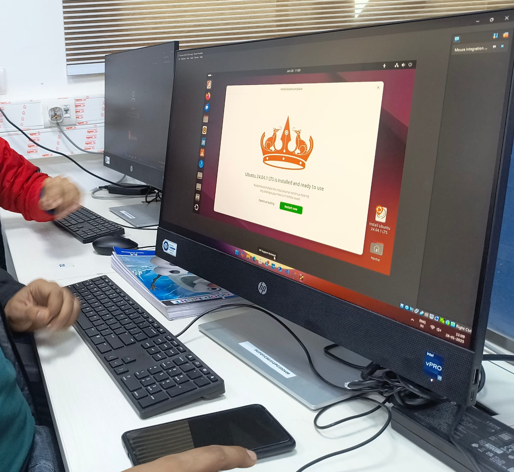
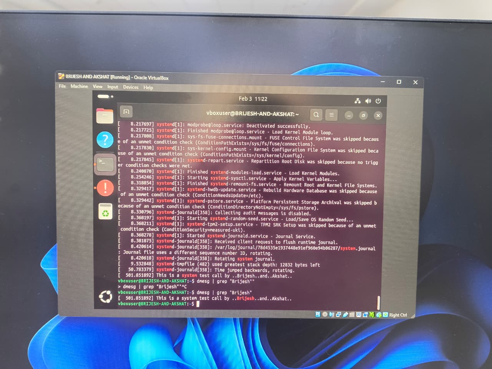

# Building a Custom Linux Kernel on Ubuntu 20.04.6 Desktop

## Step 0: Switch to Root User

To avoid permission issues, switch to the root user:

```bash
sudo su
```

Enter your password if prompted.

## Step 1: Update the System

```bash
apt-get update
```

## Step 2: Install Required Tools and Dependencies

```bash
apt-get install -y build-essential libncurses-dev libssl-dev libelf-dev bison flex wget kmod bc vim strace xz-utils systemd
```

## Step 3: Download the Kernel Source Code

```bash
wget -P ~/ https://cdn.kernel.org/pub/linux/kernel/v6.x/linux-6.12.9.tar.xz
```

## Step 4: Extract the Kernel Source Code

```bash
tar -xvf ~/linux-6.12.9.tar.xz -C ~/
```

## Step 5: Navigate to the Kernel Directory

```bash
cd ~/linux-6.12.9
```

## Step 6: Create and Add a Custom System Call

### Create Directory for the System Call

```bash
mkdir test_call
```

### Create System Call File

```bash
vim test_call/test_call.c
```

**Add the following content:**

```c
#include <linux/kernel.h>
#include <linux/syscalls.h>

SYSCALL_DEFINE0(test_call) {
    printk("This is a sample test call!\n");
    return 0;
}
```

### Create a Makefile for the System Call

```bash
vim test_call/Makefile
```

**Add the following content:**

```makefile
obj-y := test_call.o
```

## Step 7: Modify the Kernel Makefile

```bash
vim Makefile
```

### Add the Directory to Core Build Files

Search for `core-y` using `/core-y` and modify it as follows:

```makefile
core-y      += test_call/
```

## Step 8: Add the System Call Declaration

```bash
vim include/linux/syscalls.h
```

### Add the Following at the End of the File (Before `#endif`):

```c
asmlinkage long sys_test_call(void);
```

## Step 9: Update `syscalls.tbl`

### Locate `syscalls.tbl`

```bash
find . -name "*syscall_64.tbl"
```

```bash
vim ./arch/x86/entry/syscalls/syscall_64.tbl
```

### Add the System Call Entry

```bash
463  common  test_call  sys_test_call
```

## Step 10: Configure the Kernel

```bash
make defconfig
```

## Step 11: Build the Kernel

```bash
make -j$(nproc)
```

## Step 12: Install Kernel Modules

```bash
make modules_install -j$(nproc)
```

## Step 13: Install the Kernel

```bash
make install -j$(nproc)
```

## Step 14: Update GRUB Configuration

```bash
update-grub
```

## Step 15: Reboot and Select the New Kernel

```bash
reboot
```

## Step 16: Verify the Kernel Version

After booting into the new kernel, verify the version:

```bash
uname -r
```

**Expected Output:**

```
6.12.9
```

## Step 17: Test the System Call

### Create a Test Program

```bash
vim test_syscall.c
```

**Add the following content:**

```c
#include <linux/kernel.h>
#include <sys/syscall.h>
#include <stdio.h>
#include <unistd.h>
#include <string.h>
#include <errno.h>

#define __NR_test_call 463

long test_call_syscall(void) {
    return syscall(__NR_test_call);
}

int main(int argc, char *argv[]) {
    long activity;
    activity = test_call_syscall();

    if (activity < 0) { // Check if the system call failed
        perror("Sorry. Your system call appears to have failed.");
    } else {
        printf("Congratulations! Your system call is functional.\n");
        printf("Run 'dmesg' in the terminal and find out.\n");
    }

    return 0;
}
```

### Compile and Run the Test Program

```bash
gcc -o test_syscall test_syscall.c
./test_syscall
```

**Expected Output:**

```
Congratulations! Your system call is functional.
Run 'dmesg' in the terminal and find out.
```

## Step 18: Verify Kernel Logs

Since the system call uses `printk`, check the kernel logs for the output:

```bash
dmesg | tail
```

**Expected Output:**

```
This is a sample test call!
```

---

# 📸 Screenshots

<h3 align="center">Installation</h3>

<p align="center">
  
</p>

<h3 align="center">System Call Execution and dmesg Output</h3>

<p align="center">
  
</p>


